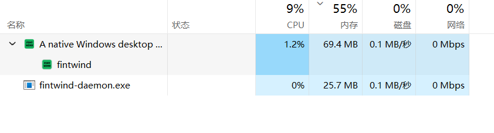

# fintwind

English | [简体中文](README.zh-CN.md)

A native Windows desktop client for [OpenCode 2](https://opencode.ai/v2/docs).
Built with Rust and [GPUI](https://github.com/zed-industries/zed/tree/main/crates/gpui),
not Electron. Manage projects, work in multiple session tabs, and follow the
agent's replies, reasoning, and tool activity in one window.

[Website](https://fintwind.xyz) · [Downloads](https://github.com/roketskiy/fintwind/releases/latest) · [Changelog](CHANGELOG.md)

> [!IMPORTANT]
> **fintwind 0.2.3 supports OpenCode 2.0.19.** OpenCode 2 is still evolving;
> compatibility with newer versions is not guaranteed. Use the pinned version
> below rather than installing the latest CLI without checking compatibility.
> OpenCode 1 is not the supported backend.

Session demo: switching models, a session in progress, and scrolling a long transcript.

https://github.com/user-attachments/assets/beb2dcb5-88dd-4f2b-9415-153af9c93bf9

## Install

### 1. Install OpenCode 2

fintwind requires the local `opencode` CLI; it is not bundled with the app.
Choose **one** of these commands in PowerShell:

With [Node.js and npm](https://nodejs.org/):

```powershell
npm install -g @opencode/cli@2.0.19
```

Or with [Bun](https://bun.sh/):

```powershell
bun install -g --trust @opencode/cli@2.0.19
```

The Bun `--trust` flag allows the package's required install script.
These use the V2 package, `@opencode/cli`; see the
[official installation guide](https://opencode.ai/v2/docs/) for other methods.

Open a new PowerShell window and verify the installation:

```powershell
opencode --version
opencode
```

Check that the version is `2.0.19`. In the OpenCode terminal interface, use
`/connect` to connect a model provider, or use your existing provider configuration.
fintwind uses OpenCode's models, provider credentials, and MCP configuration.
You do not need to start `opencode serve` yourself: fintwind starts its own
private local server.

### 2. Install fintwind

- **System:** Windows 10 version 1809 or newer, or Windows 11; x86_64 or Arm64.
- **Graphics:** a Direct3D 11 driver supporting feature level 11_0 or newer.
- **Git features:** [Git for Windows](https://git-scm.com/download/win), available on `PATH`.

Download `fintwind-<version>-<arch>-Setup.exe` from the
[latest release](https://github.com/roketskiy/fintwind/releases/latest).
The installer runs per-user in `%LOCALAPPDATA%\Programs\fintwind` and does not
require administrator rights.

For the portable version, extract the release `.zip` and run `fintwind.exe`.
**Keep `fintwind.exe` and `fintwind-daemon.exe` in the same folder** — the app
launches the daemon from its own directory.

When a newer release is available, the **Update** button opens its release page.
fintwind does not download or install updates automatically. See
[Windows setup and troubleshooting](docs/windows.md) for SmartScreen, CLI
detection, data locations, and WebView2 details.

## Features

- **Projects and session tabs.** Group sessions by project and open multiple
  sessions in one window, with tab reordering and unread indicators.
- **Session controls.** Switch model, reasoning effort where supported, and
  access mode (Ask, Auto-accept edits, Full access). Queue or steer a follow-up
  while the agent works, and use OpenCode's native revert and restore for
  eligible Git-backed turns.
- **Readable agent activity.** View streaming replies, reasoning, tool calls,
  subagent activity, and nested Code Mode calls with OpenCode's tool names.
  Transcripts and reasoning use virtualized lists to limit per-frame work.
- **Files and Git.** Browse workspace files, open multiple file tabs, inspect
  diffs, and view Git commit history. Attach files from the composer or by
  dropping them onto the conversation; images and PDFs are sent inline to OpenCode.
- **Terminal and browser.** Work in a built-in terminal or the optional
  WebView2 browser panel. The session interface itself remains native GPUI.
- **Appearance settings.** Choose Fintwind or one of 12 additional theme
  families, select light/dark/system mode, and customize UI and code fonts and
  text sizes. Animations honor the system's reduce-motion preference.
- **Usage statistics.** Explore local OpenCode session history through an
  activity heatmap, daily and hourly charts, and model/provider rankings,
  including subagent usage. Displayed costs are estimates, not billing records.
- **MCP management.** Browse the MCP marketplace, add remote servers, complete
  OAuth login, and check connection status.
- **Native math.** Typeset inline and display formulas, including `\(…\)` and
  `\[…\]`, with layout work performed on background workers.

## Local data and scope

fintwind has no account of its own and does not provide cloud synchronization.
App-managed projects, tasks, and attachments are stored in local SQLite and
files; OpenCode owns its native session data. **Local storage does not mean
offline inference:** prompts and relevant content are sent to the model
providers and tools you configure in OpenCode.

This is an independent [GPL-3.0-only](LICENSE) fork of
[waku](https://github.com/egoist/waku) by [EGOIST](https://github.com/egoist),
not the official OpenCode desktop app. fintwind ships for Windows and uses
OpenCode 2 as its only agent backend. Multiple model providers are available
through OpenCode; other agent backends are outside this fork's scope.

### Memory snapshot

One Task Manager snapshot shows the desktop at 69.4 MB and
`fintwind-daemon.exe` at 25.7 MB — about 95 MB combined. This is not a benchmark
or a total for the full agent stack: it excludes OpenCode and any other
processes, and actual usage varies by workload.



## Architecture

The desktop uses [`fintwind-client`](crates/fintwind-client) to communicate with
a separate [`fintwind-daemon`](crates/fintwind-daemon) process over the
authenticated, versioned WebSocket contract in
[`fintwind-protocol`](crates/fintwind-protocol).
[`fintwind-core`](crates/fintwind-core) implements daemon-owned storage,
workspace and Git operations, and the OpenCode integration. The daemon listens
on loopback and authenticates clients with a token generated at launch.

Release desktop preferences live in `~/.fintwind/app.json`; debug builds use
`temp/app.json`. Daemon provider settings live in `~/.fintwind/settings.json`.
Tasks without a project use workspaces under
`~/.fintwind/projects/<date>/<slug>`.

## Development

Requires Windows, the MSVC C++ toolchain and Windows SDK,
[Rust 1.96 or newer](https://www.rust-lang.org/tools/install), and
[Bun](https://bun.sh/). Follow [CONTRIBUTING.md](CONTRIBUTING.md) for setup and checks.

```sh
bun install
bun run dev
```

The development watcher builds the app and a separate
`target/debug/fintwind-debug-daemon.exe`; provider-only changes can replace the
daemon without restarting the debug app. Release builds place
`fintwind-daemon.exe` beside `fintwind.exe`.

See [RELEASING.md](RELEASING.md) for packaging and release maintenance.

## License

[GNU General Public License v3.0 only](LICENSE).
