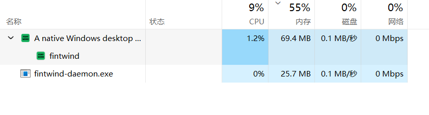

# fintwind

[English](README.md) | 简体中文

fintwind 是 [OpenCode](https://opencode.ai) 的原生 Windows 桌面应用。界面由 Rust 和
[GPUI](https://github.com/zed-industries/zed/tree/main/crates/gpui) 直接在 GPU 上绘制，
不是 Electron 套壳。项目、会话和对话记录都留在你自己的机器上。

54 秒演示：切换模型、进行中的会话，以及滚动一条很长的对话记录。

https://github.com/user-attachments/assets/8ca3cd89-3044-4e90-81cd-ebd9f55818ef

## 安装

从[最新 release](https://github.com/roketskiy/fintwind/releases/latest) 下载
`fintwind-<version>-<arch>-Setup.exe` 并运行。安装程序按用户安装到
`%LOCALAPPDATA%\Programs\fintwind`，不需要管理员权限。旁边同时提供便携版 `.zip`。

`fintwind.exe` 和 `fintwind-daemon.exe` 必须放在同一目录。应用从自己旁边启动
daemon，只拷走其中一个就起不来。

系统要求是 Windows 10 1809 或更新版本，或 Windows 11，x86_64 或 Arm64。
SmartScreen、数据目录和尚未支持的功能见 [docs/windows.md](docs/windows.md)。

有新版本时，侧栏会出现「更新」按钮，点开对应的 GitHub release。应用不会自己下载安装。

## 环境要求

fintwind 只驱动一个 agent 后端：本机的 [OpenCode](https://opencode.ai) 服务。
请先安装并登录 `opencode` CLI。fintwind 会拉起它；会话、模型、provider 和
MCP 服务器都来自这个后端。

## 特点

- **原生渲染。** 会话界面是 Rust + GPUI。只有右侧可选的浏览器面板使用系统 WebView2。
- **长对话仍然跟手。** 对话记录和思考过程做了虚拟化，每一帧只构建屏幕上看得见的行，
  高刷新率屏幕上流式输出也不会拖垮界面。
- **跟着系统走。** 深色和浅色跟随 Windows 主题，动效尊重「减弱动态效果」，
  主要操作可以用键盘完成。
- **Windows 自己的壳。** 系统托盘、原生菜单、内置终端、按用户安装。
- **本地优先。** 项目、会话、对话记录和附件都在本机（SQLite 和本地文件）。
  daemon 只监听回环地址，并用每次启动生成的令牌鉴权。fintwind 没有自己的账号，
  也不做云端同步。
- **默认零遥测。** 配置就是本地 JSON 文件，可以备份，也可以直接拷走。
- **会话留在你手里。** 在输入栏切换模型、思考程度和访问模式（询问、自动接受编辑、完全访问）。
  agent 工作时可以排队或插话。基于 Git 的回合可以用 OpenCode 自己的 revert 回退，
  会话保持同一个。
- **工具过程读得清。** 思考、工具调用和嵌套的 Code Mode 调用按原顺序留在对话里，
  卡片上是 OpenCode 的原始工具名。
- **用量来自你自己的记录。** 从本机 OpenCode 会话统计 token 和费用：活动热力图、
  按日柱状图、按模型排名。
- **MCP 市场。** 浏览并添加远程 MCP 服务器，支持 OAuth 登录，并能看到连接状态。
- **公式按公式排版。** 行内和独立公式原生排版，包括模型更常输出的 `\[…\]` 和 `\(…\)`，
  排版不占 UI 线程。

## 运行时内存

窗口开着时的一次任务管理器读数。桌面进程 69.4 MB，`fintwind-daemon.exe` 25.7 MB，
加在一起大约 95 MB。



## 范围

fintwind 是 [EGOIST](https://github.com/egoist) 的 [waku](https://github.com/egoist/waku)
的 fork，同样采用 [GPL-3.0](LICENSE)。这个 fork 只保留一个后端——本机 OpenCode——并且只发布
Windows。多 provider、macOS 和 Linux 请用上游项目。

它不是 OpenCode 官方桌面端，而是给已经在用 OpenCode、希望对话记录跑在原生窗口里的
Windows 用户。

## 架构

原生桌面端是独立 `fintwind-daemon` 进程的 RPC 客户端。Provider 会话运行在
[`fintwind-core`](crates/fintwind-core) 中，隐藏在
[`fintwind-protocol`](crates/fintwind-protocol) 的带鉴权、带版本化的
WebSocket 契约之后。桌面端只依赖
[`fintwind-client`](crates/fintwind-client)，不依赖 daemon 的具体实现。

daemon 拥有任务 SQLite 数据、上传的附件、provider 原生的会话分叉，以及全部
工作区文件系统与 Git 操作。它返回的路径一律指 daemon 所在主机。桌面端只保留
展示状态和可丢弃的预览缓存。daemon 只监听回环地址，并用每次启动生成的令牌鉴权。

无项目的任务工作区位于 daemon 主机的 `~/.fintwind/projects/<日期>/<slug>` 下。
daemon 首次加载时会把旧版 `~/.fintwind/<日期>/<slug>` 布局创建的工作区迁移过去。

配置归属同样分离：Release 桌面端写 `~/.fintwind/app.json`，Debug 则隔离在
`temp/app.json`。daemon 的 provider 设置保存在 `~/.fintwind/settings.json`。

连接到桌面进程之外托管的 daemon 时，fintwind 绝不在客户机上解释 daemon 的路径。
因此在协议增加 daemon 主机侧的目录选择器与终端流端点之前，本地目录选择器和
PTY 不可用；文件、diff、Git、skills、用量、任务状态与附件则已经走 daemon RPC。

## 开发

开发环境要求 Windows 10 1809 或更新、MSVC 工具链、
[Rust 1.96 或更新](https://www.rust-lang.org/tools/install) 以及
[Bun](https://bun.sh/)。请先按
[CONTRIBUTING.md](CONTRIBUTING.md) 安装原生构建依赖。

```sh
bun install
bun run dev
```

Release 构建把 `fintwind-daemon` 放在应用旁边。开发时 daemon 位于
`target/debug/fintwind-debug-daemon`，这样只改 provider 相关代码时可以
单独替换 daemon，不必重启 fintwind Debug。

开发流程与检查项见 [CONTRIBUTING.md](CONTRIBUTING.md)；
发布维护者还应阅读 [RELEASING.md](RELEASING.md)。

## 许可证

fintwind 基于 [GNU General Public License v3.0 only](LICENSE) 授权。
